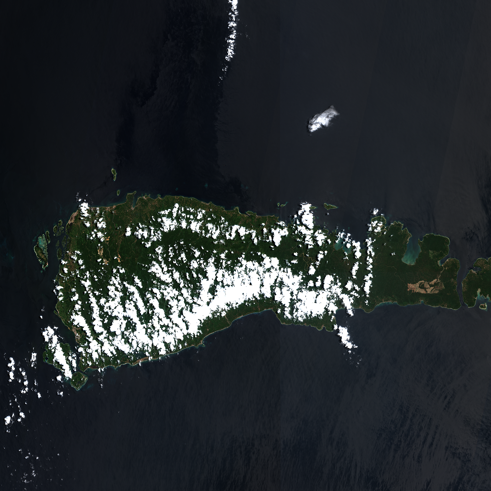

# Taliabu Environmental Monitor

Aplikasi pemantauan lingkungan berbasis peta untuk Pulau Taliabu, Maluku Utara. Menggabungkan data satelit Sentinel-2 (Copernicus Data Space), konteks spasial resmi (IUP pertambangan, hidrologi, garis pantai dari BIG), dan deteksi perubahan otomatis dalam satu antarmuka yang berjalan sepenuhnya di Cloudflare dengan biaya infrastruktur nol.



## Penting: Sifat Data

Seluruh lapisan satelit (NDVI, MNDWI, NDTI, deteksi perubahan) adalah **proxy remote-sensing**, bukan pengukuran laboratorium. Aplikasi ini:

- dapat menunjukkan indikasi perubahan tutupan lahan atau kekeruhan air, tetapi tidak dapat memastikan komposisi kimia atau klaim polusi spesifik;
- selalu menampilkan metadata sumber, resolusi, tanggal akuisisi, dan cakupan bebas awan agar pembaca bisa menilai keandalan sendiri;
- menahan penilaian otomatis ketika cakupan awan terlalu rendah ("Too cloudy to judge").

## Fitur

**Peta dan konteks statis**
- Basemap OpenFreeMap dengan lapisan konteks: batas administratif dan pulau, IUP pertambangan (klik untuk detail), sungai, watershed (resmi BIG + derived D8), muara sungai, garis pantai, elevasi dan lereng (DEMNAS).
- Klik berprioritas (IUP > titik > area) dan panel inspektur yang sadar konteks.

**Satelit dan lapisan lingkungan**
- Pencarian scene Sentinel-2 L2A via Copernicus Data Space STAC dengan filter cloud coverage, timeline scene, dan mode perbandingan before/after.
- Lapisan raster on-the-fly dari Sentinel Hub: True Color, NDVI, MNDWI, NDTI (kekeruhan air, Lacaux et al. 2007), tepi air scene (NDWI), masing-masing dengan cloud masking SCL.

**Analisis**
- Gambar AOI (klik poligon, dobel-klik selesai, Escape batal) dengan metrik Turf.js: luas, persentase tumpang-tindih IUP, jarak ke sungai dan garis pantai, watershed terkait. Batas luas 10.000 ha.
- Deteksi perubahan otomatis antar dua tanggal: kehilangan vegetasi (NDVI) dan perubahan permukaan (MNDWI) dalam hektare, dengan mask AOI dan guard cakupan awan.
- Panel analitik: proporsi tutupan lahan (vegetasi, terbuka, air) untuk lingkup Pulau, Viewport, AOI, atau Permit tertentu.

**Alert lingkungan**
- Empat aturan otomatis dari hasil analisis AOI: kehilangan vegetasi luas, perubahan permukaan dekat sungai, dekat garis pantai, dan di luar IUP. Ambang bisa diatur langsung (hektare, jarak meter).
- Alert tersimpan di D1 beserta evidence lengkap: metode, cakupan awan, jendela tanggal, threshold, konteks spasial, dan sumber. Log alert bisa difilter per jenis dan diklik untuk fokus peta ke lokasinya.

**Persistensi**
- Metadata scene STAC di-cache write-through ke Cloudflare D1 (dedup, fallback saat STAC gagal) dan setiap analisis render tercatat di tabel `analysis_runs`.

## Stack

| Bagian | Teknologi |
|---|---|
| Frontend | Vue 3, TypeScript, Vite, MapLibre GL JS, Turf.js |
| Backend | Cloudflare Workers, Hono, TypeScript |
| Database | Cloudflare D1 (metadata saja, tanpa raster) |
| Satelit | Copernicus Data Space (Catalog dan Sentinel Hub), Sentinel-2 |
| Data spasial | OpenFreeMap, OpenStreetMap, BIG/Ina-Geoportal, DEMNAS, ESDM |

## Struktur Proyek

```text
src/
└── features/environmental-map/
    ├── EnvironmentalMapPage.vue     # orkestrasi halaman utama
    ├── components/                  # MapView, LayerPanel, InspectorPanel, Timeline, ...
    ├── composables/                 # analisis AOI, change detection, alerts, analytics
    └── layers/                      # lapisan statis (IUP, hidrologi, batas)

worker/
├── index.ts                         # Hono app: /api/health, routes, SPA fallback
├── routes/                          # scenes, render, alerts
└── services/                        # sentinel-hub, STAC, copernicus-token

migrations/0001_init.sql             # skema D1 (satellite_scenes, analysis_runs, environmental_alerts, app_config)
scripts/terrain/                     # preprocessing Python: DEMNAS → elevation/slope/fdr/outlets
public/data/                         # GeoJSON konteks + hasil preprocessing (demnas.tif di-gitignore)
docs/                                # PLAN.md (roadmap), ARCHITECTURE.md, PRD.md, DESIGN-SYSTEM.md
```

## Menjalankan Secara Lokal

Prasyarat: Node.js 20+, Python 3 dengan `numpy` dan `Pillow` (hanya untuk preprocessing), akun Copernicus Data Space.

1. Instal dependensi:

   ```bash
   npm install
   ```

2. Buat file `.dev.vars` di root untuk kredensial Copernicus:

   ```text
   COPERNICUS_CLIENT_ID=xxx
   COPERNICUS_CLIENT_SECRET=xxx
   ```

3. Terapkan migrasi D1 lokal:

   ```bash
   wrangler d1 migrations apply taliabu-db --local
   ```

4. Jalankan dua proses di terminal terpisah:

   ```bash
   npm run dev          # frontend Vite (proxy /api ke worker)
   npm run dev:worker   # Cloudflare Worker di port 8787
   ```

   Buka http://localhost:5173.

### Preprocessing Data (opsional)

Data konteks statis sudah tersedia di `public/data/`. Untuk meregenerasi lapisan terrain dari DEMNAS:

```bash
cd scripts/terrain
python preprocess.py   # unduh DEMNAS, hasilkan elevation/slope/fdr
python hydro.py        # flow direction → watershed
python outlets.py      # muara D8 + jarak ke IUP terdekat
```

## API

| Endpoint | Fungsi |
|---|---|
| `GET /api/health` | Status layanan |
| `GET /api/scenes` | Pencarian scene STAC (cache D1, fallback baca cache) |
| `POST /api/render` | Render raster Sentinel Hub (evalscript: ndvi, mndwi, ndti, dll.), dicatat di `analysis_runs` |
| `GET /api/render/tile/:z/:x/:y` | Tile raster untuk peta |
| `GET /api/alerts` | Daftar alert (filter `kind`, `limit`) |
| `POST /api/alerts` | Simpan alert beserta evidence |

## Roadmap

Rencana lengkap dan status tiap fase ada di [docs/PLAN.md](docs/PLAN.md).

| Fase | Isi | Status |
|---|---|---|
| 0-7 | Fondasi, peta, konteks statis, scene discovery, timeline, lapisan raster, compare | Selesai |
| 8 | AOI dan inspeksi spasial | Selesai |
| 9-10 | Deteksi perubahan otomatis, mode dampak pertambangan | Selesai |
| 11-12 | Terrain/hidrologi, pesisir dan sedimen (NDTI) | Selesai |
| 13 | Panel analitik tutupan lahan | Selesai |
| 14 | Persistensi D1 | Selesai |
| 15 | Alert lingkungan | Selesai |
| 16 | Export dan evidence (PNG, CSV, GeoJSON, JSON, share URL) | Selesai |
| 17 | Scheduled discovery | Selesai |
| 18 | Cloudflare security hardening | Selesai |
| 19 | Performance dan free-tier hardening | Berikutnya |
| 20 | Production readiness | Pending |

## Deployment

```bash
npm run deploy
```

Sebelum deploy pertama: buat database D1 (`wrangler d1 create taliabu-db`), ganti `database_id` placeholder di `wrangler.jsonc`, lalu jalankan `wrangler d1 migrations apply taliabu-db --remote`. Kredensial Copernicus diatur sebagai secret Worker (`wrangler secret put`).

## Dokumentasi Lanjutan

- [docs/PLAN.md](docs/PLAN.md): roadmap eksekusi fase demi fase beserta catatan verifikasi.
- [docs/DEPLOYMENT.md](docs/DEPLOYMENT.md): langkah deploy Worker, D1, Terraform WAF, dan verifikasi production.
- [docs/ARCHITECTURE.md](docs/ARCHITECTURE.md): keputusan arsitektur.
- [docs/PRD.md](docs/PRD.md): kebutuhan produk.
- [docs/DESIGN-SYSTEM.md](docs/DESIGN-SYSTEM.md): sistem visual earth-tone.
